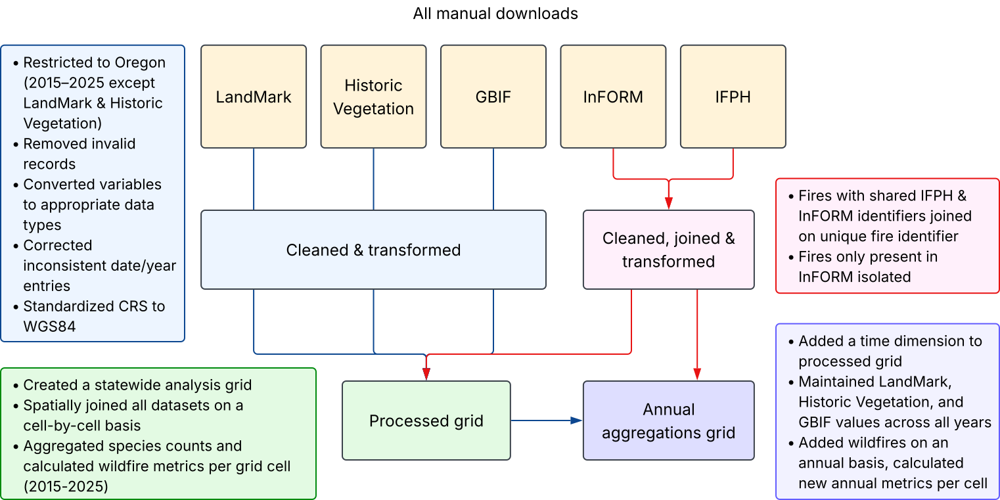
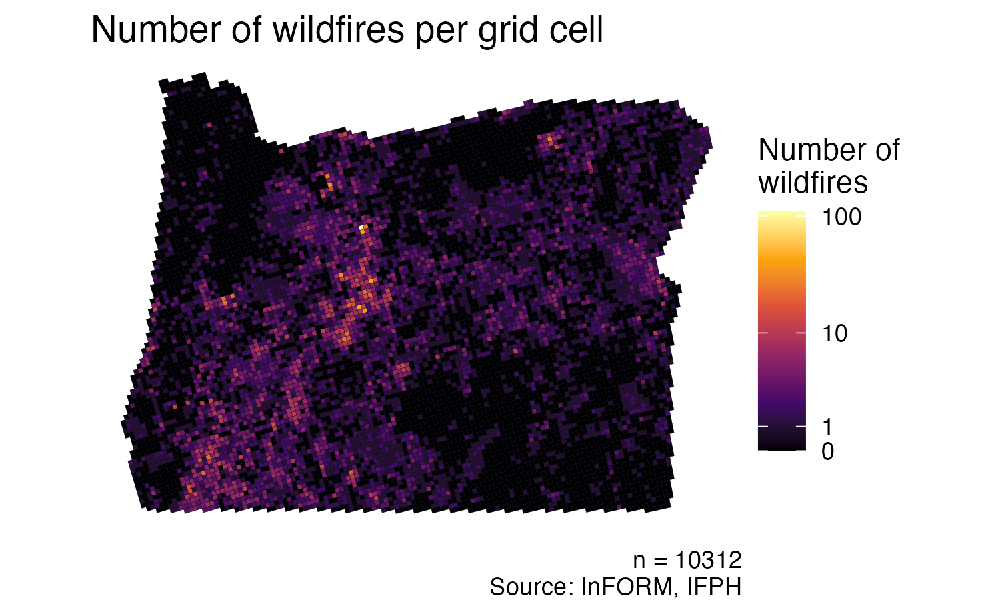
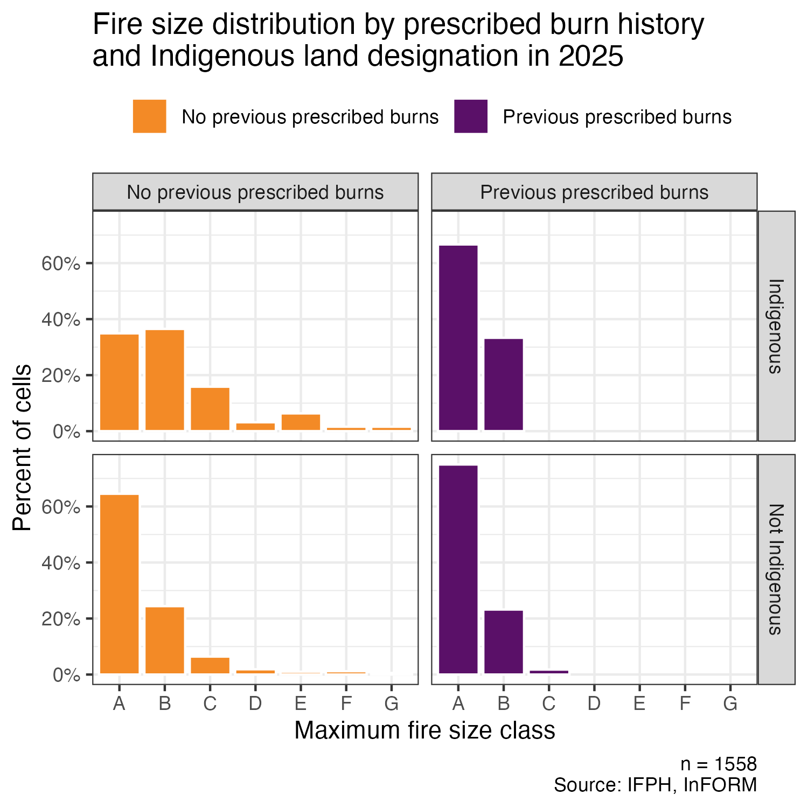

## The one-liner

> We integrated **geospatial fire, species occurrence, and Indigenous land data** 
> into a **statewide 5 by 5 km grid dataset** so that
> **Tribal governments and land managers** can see 
> **landscape-scale patterns in fire severity**.

**Role:** Spatial engineering, data cleaning, fire severity modeling, and data visualization.\
**Team:** [Amaya Supancich-McCord](https://github.com/asupancichmccord)\
**Repo:** [https://github.com/Fiden-Supancich-McCord/data510-fire](https://github.com/Fiden-Supancich-McCord/data510-fire)

## The question

As wildfires grow more frequent and severe in the Pacific Northwest, many are 
looking to ongoing and historic Indigenous stewardship (including prescribed fire) 
for potential solutions.
We asked if publicly available data could be integrated into a single 
dataset to determine whether fire severity trends in 2015-2025 were associated with 
federally recognized Indigenous land, prescribed burns, or forest composition.

## The data

We combined five data sources--LandMark for Indigenous land designation, 
two NIFC fire data sources (InFORM fire occurrence records and Interagency 
Fire Perimeter History (IFPH)), and GBIF citizen science species occurrence 
records and Oregon Historic Vegetation for forest composition. 
Three sources (LandMark, Historic Vegetation, IFPH) were shapefiles 
with complex multipolygon geospatial information, and two (InFORM, GBIF) 
were coordinate based. 

{fig-alt="Pipeline showing the integration of 5 data sources into a processed grid and annually aggregated grid." width=90%}

Beyond missing values and empty columns, the hard part was integrating 
all five sources with different shapes and purposes into a single dataset. 
We joined distinct fire data with matching occurrences and combined two types 
of vegetation data before transforming and aggregating all sources, including 
over 70,000 individual observations, into a standardized dataset while 
retaining their spatial relationships.

While the engineered grid limits precision, as each cell is about 6178 acres, it allows us to create models using these disparate features that would otherwise be impossible or extremely computationally expensive to run. 

{fig-alt="Map of Oregon made of grid cells, showing the number of fires that have occurred in each cell between 2015-2025." width=80%}

## The approach

For statistical analysis, we used Welch's t-test to determine if there were
significant differences in fire size and duration across several factors--
Indigenous land designation, prescribed burn history and fire history. 
We used Cohen's d to understand the scale of the difference between groups. 

Alongside statistical analysis, we employed a predictive modelling approach, 
using Random Forest classifiers to predict fire size class based on a cell's 
vegetation characteristics, Indigenous land designation, previous prescribed 
burns, previous fires, and previous fire size on an annual basis. We used 
SHAP values to determine the impact of each feature on predictions. 

## Findings

{fig-alt="A bar plot faceted by prescribed burn history and Indigenous land status. Cells with prescribed burns had higher proportions of small fires (Class A and B). Indigenous cells had slightly more large fires (Class E-G), but otherwise have similar distributions to non-Indigenous cells." width=85%}

We found significant but small-scale differences in fire size between cells 
that previously experienced prescribed burns and those that did not 
(*p* = 0.001, Cohen's *d* = 0.19). Similarly, we found that cells that had 
previously experienced wildfires had a significant difference in later wildfire 
size than cells that hadn't had previous fires (*p* < 2.2e-16). Although the 
scale of difference is still small, it was larger than the difference found in 
the prescribed burn test (Cohen’s *d* = 0.33). There were not significant 
differences in fire size or duration in cells containing federally recognized 
Indigenous land compared to those that do not (*p* = 0.49), although the 
distribution of those metrics varied across categories.

Predictive models performed poorly--the best model had an accuracy of 0.473 
(with a baseline of 0.398, the size of the largest category). Presence of 
Ponderosa Pine (or the sum of plant occurrences when combined), previous 
wildfire rolling sum, and previous wildfire acreage rolling sum served as 
the most influential factors in the model's predictions. The models' inability 
to consistently categorize wildfire size with these features shows that there are 
more factors influencing wildfire size than we were able to account for.

While we explored occurrence records for seven plant species, our data is 
unable to account for Oregon's full biodiversity, limiting our ability to 
comprehensively examine forest ecology. Similarly, we used fire size and duration 
as proxies for fire severity as those features exhibited the smallest amount 
of missingness across our data sources, but they should not be interpreted 
as a complete measure of fire severity. 

## The full write-up

<iframe src="projects/capstone/writeup.pdf" width="100%" height="800px"
  style="border: 1px solid #ddd;"></iframe>

## Dig deeper

- 📦 **Code & pipeline:** [Fiden-Supancich-McCord/data510-fire](https://github.com/Fiden-Supancich-McCord/data510-fire)
- 📊 **Poster:** [Oregon on Fire poster](https://drive.google.com/file/d/1Gb-F29B0HOuR4Pgs4bNN8bUZPQu9E1QX/view)
